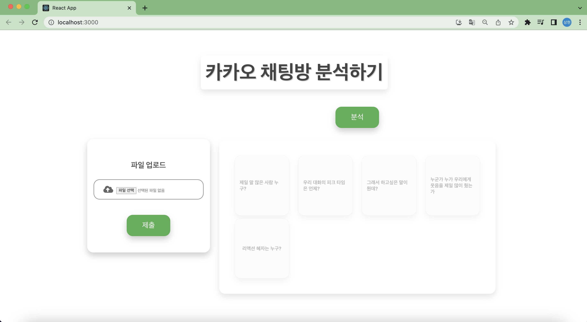
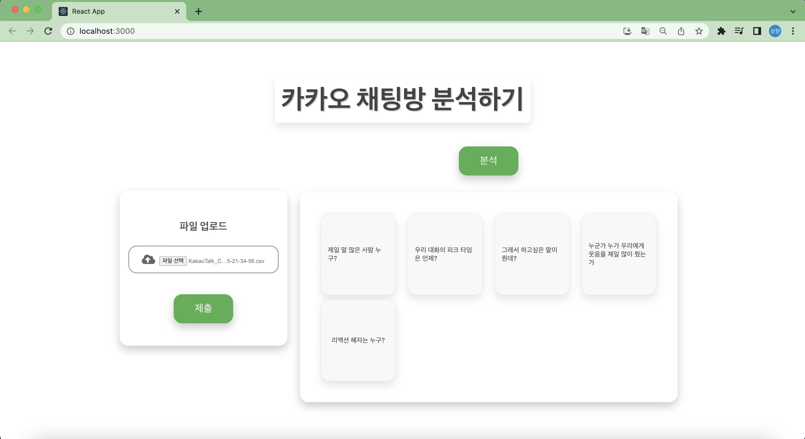
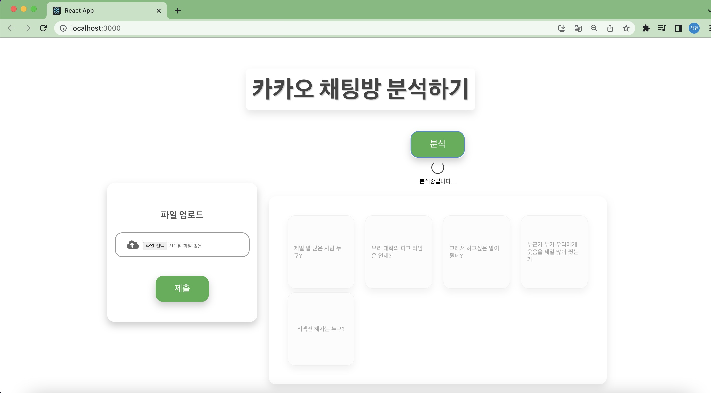
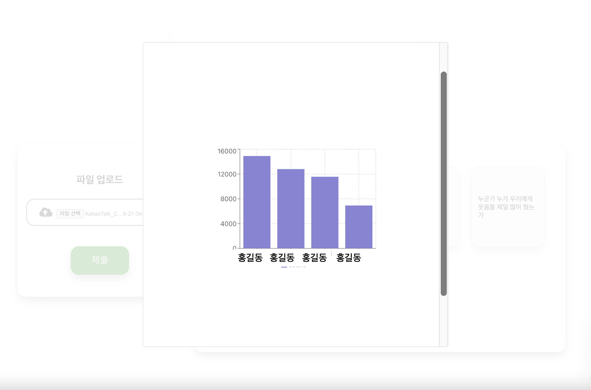
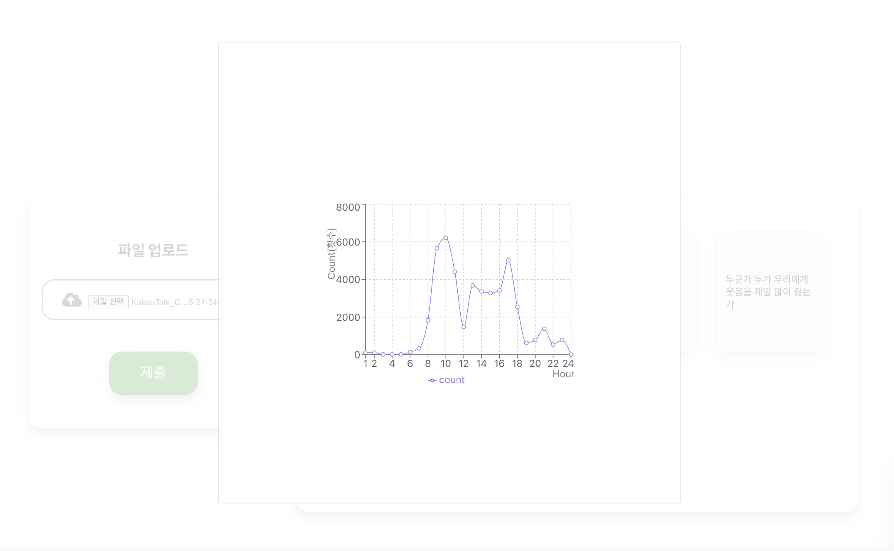
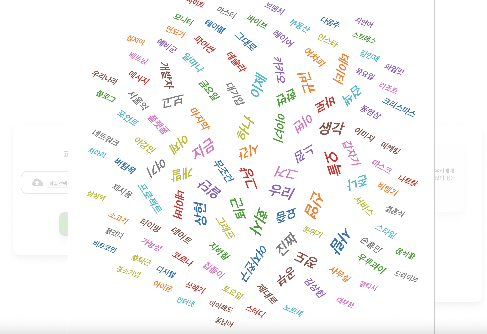

# kakao-chat-analysis

**Who We Are** 이라는 프로젝트를 시작합니다. 
카카오톡 그룹채팅방을 분석하는 프로젝트입니다. 
카카오톡 채팅방 데이터 파일을 제출하면, 분석 결과를 보여주는 웹 앱플리케이션을 개발하는 것이 프로젝트 목표입니다.

## 개요

|dataset|분석 모듈 개발|REST API|웹 UI|
|------|---------|------------- |-----|
|카카오채팅|python|Django REST framework|React.js|

## 프로젝트 목표

이 프로젝트의 궁국적인 목표는, 카카오톡 채팅방 분석을 통해 채팅 구성원들의 특성을 파악하는 것입니다. 

목표를 위해 아래와 같이 단계적 목표를 수행할 것입니다.

step1. 기초통계분석 
step2. 구성원의 특성을 나타낼 수 있는 분석 수행 
step3. 웹 서비스 개발

## 단계별 수행내용

**step1. 기초통계분석**
- 대화가 가장 활발한 시간
- 가장 많이 사용한단어
- 각 구성원별 채팅 횟수 등

**step2. 구성원의 특성을 나타낼 수 있는 분석 수행**
- 가장 많은 웃음을 선물한 구성원은 누구?
- 가장 많이 웃는 구성원은 누구?
- 이 그룹의 리더는 누구?
- 각 구성원의 감정의 변화 추이
- 환상의 짝궁은 누구?
- 가장 많은 외면을 받은 구성원은 누구? 등

**step3. 웹 서비스 개발**
- python 장고를 활용한 REST API 개발
- react.js 활용한 UI 개발 (공부해야함)

## 일정
| 일자                  | 작업                               | 결과  |    
|---------------------|-----------------------------------|-----|
| 22.08.27 ~ 22.09.03 |파일 업로드 기능 구현                | 완료  |
| 22.09.04 ~ 22.09.18 | data preprocessing                  | 완료  |
| 23.03.15 ~ 23.03.31 | 기초 통계 분석 모듈,REST API 개발    | 완료  |
| 23.04.01 ~ 23.04.30 | 기통계 분석 결과 대쉬보드 개발       | 완료  |
| 23.05.01 ~ 23.05.10 | 프로젝트 1차 완료 정리               | -   |
| 23.04.20 ~ 23.05    | 구성원 특성 분석 모듈 및 대쉬보드 개발 | -   |

## 프로젝트 결과

-시작화면 

-파일 선택 후 제출 버튼 클릭 

-분석 버튼 클릭 

-분석 버튼 클릭 

-분석 버튼 클릭 

-그래서 하고샆은 말이 뭔데? 분석 결과 화면(x표시 사람이름) 
